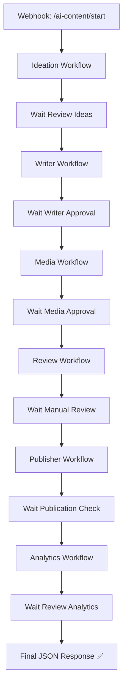

Parfait 🚀
On passe donc à la **dernière étape de ce sprint** : la **documentation complète et guide d’utilisation** de ton système global d’automatisation IA dans **n8n**.

---

# 🧭 **Documentation — AI Content Automation System (n8n)**

## ⚙️ Objectif du système

Automatiser la **création, validation et publication de contenu multicanal** (LinkedIn, Instagram, TikTok, YouTube) grâce à des agents IA interconnectés dans n8n.
Chaque module est **modulaire et modifiable**, pour t’offrir **contrôle + flexibilité** à chaque étape.

---

## 🧱 Architecture générale

### 📡 Workflows & Webhooks

| Module                  | Nom du workflow                | Webhook Trigger             |
| ----------------------- | ------------------------------ | --------------------------- |
| 🧠 Idéation             | `Ideation_Workflow`            | `/webhook/ideation/start`   |
| ✍️ Rédaction            | `Writer_Workflow`              | `/webhook/writer/start`     |
| 🖼️ Média IA            | `Media_Workflow`               | `/webhook/media/start`      |
| ✅ Relecture             | `Review_Workflow`              | `/webhook/review/start`     |
| 📢 Publication          | `Publisher_Workflow`           | `/webhook/publisher/start`  |
| 📊 Analytics            | `Analytics_Workflow`           | `/webhook/analytics/start`  |
| 🪄 Master orchestrateur | `AI_Content_Automation_Master` | `/webhook/ai-content/start` |

Chaque sous-workflow peut fonctionner :

* soit **indépendamment** (en appelant directement son webhook),
* soit **depuis le Master**, qui les enchaîne automatiquement **avec pauses de validation**.

### Payload to test each workflow

#### Ideation
```json
{
  "topic": "digital marketing",
  "tone": "professional"
}
```
```bash
curl -k -X POST   https://n8n.securaops.site/webhook-test/webhook/ideation/start   -H "Content-Type: application/json"   -d '{
    "topic": "Les usages concrets de l'\''IA pour les indépendants",
    "tone": "inspirant et pédagogique",
    "platforms": ["LinkedIn", "Instagram"]
  }'
```
#### Rédaction
```json
{
  "platforms": "LinkedIn, Instagram, YouTube, TikTok",
  "idea": "l'importance du marketing digital",
  "tone": "professionnel et engageant"
}
```
#### Média IA
```json
{
  "text": "L'importance de l'innovation technologique dans le monde moderne"
}
```
#### Relecture
```json
{
  "content": "Sample content for review",
  "author": "John Doe",
  "type": "blog_post"
}
```
#### Publication
```json
{
  "linkedin_text": "Découvrez nos nouvelles innovations en matière de technologie digitale ! 🚀 #Innovation #Digital",
  "platform": "linkedin"
}
```
#### Analytics
```json
{
  "timeframe": "last_30_days",
  "metrics": ["impressions", "engagement", "follower_growth"]
}
```
#### Master Workflow
```json
{
  "topic": "l'avenir de l'IA dans le marketing",
  "tone": "professionnel",
  "platforms": "LinkedIn, Instagram, YouTube, TikTok"
}
```


---

## 🔁 Flux global



---

## 💡 Exemple d’appel pour tout le pipeline

```bash
POST https://n8n.yourdomain.com/webhook/ai-content/start
{
  "topic": "Les usages concrets de l'IA pour les indépendants",
  "tone": "inspirant et pédagogique",
  "platforms": ["LinkedIn", "Instagram"]
}
```

### 🔁 Résultat final

Réponse JSON finale (simplifiée) :

```json
{
  "result": "Pipeline completé avec succès !",
  "data": {
    "ideas": ["5 façons d'utiliser l'IA quand on est freelance..."],
    "linkedin_text": "En tant qu'indépendant, voici comment l'IA peut vous faire gagner du temps...",
    "image_url": "https://cdn.n8n.ai/generated/1234.png",
    "published_urls": ["https://linkedin.com/feed/update/xyz"],
    "insights": ["Le post sur LinkedIn a eu +23% d'engagement"]
  }
}
```

---

## 🧩 Description de chaque workflow

### 🧠 1️⃣ Ideation_Workflow

* **Entrée** : `topic`, `tone`
* **Action** : Génère 5 idées IA pour LinkedIn/Instagram.
* **Sortie** : `{ "ideas": [...] }`
* **Pause** : `Wait Review Ideas` — tu valides ou ajustes avant d’avancer.

---

### ✍️ 2️⃣ Writer_Workflow

* **Entrée** : `idea`, `tone`, `platforms`
* **Action** : Rédige des textes adaptés à chaque plateforme.
* **Sortie** : `{ "linkedin_text": "...", "instagram_text": "...", "youtube_title": "...", ... }`
* **Pause** : `Wait Writer Approval` — tu peux relire et modifier le contenu.

---

### 🖼️ 3️⃣ Media_Workflow

* **Entrée** : `text` (par ex. le texte LinkedIn)
* **Action** : Crée une image (DALL·E 3) cohérente avec le ton et le thème.
* **Sortie** : `{ "url": "https://cdn..." }`
* **Pause** : `Wait Image Approval` — tu valides le visuel avant publication.

---

### 🗓️ 4️⃣ Review_Workflow

* **Entrée** : `content`, `image_url`
* **Action** : Sauvegarde dans Google Sheets ou Notion pour validation.
* **Sortie** : `{ "status": "approved" }`
* **Pause** : `Wait Manual Validation` — phase d’approbation humaine.

---

### 📢 5️⃣ Publisher_Workflow

* **Entrée** : `linkedin_text`, `image_url`
* **Action** : Publie automatiquement via API LinkedIn (ou Meta/TikTok).
* **Sortie** : `{ "urls": [...] }`
* **Pause** : `Wait Publication Check` — vérifie la publication avant analytics.

---

### 📊 6️⃣ Analytics_Workflow

* **Entrée** : `published_urls`
* **Action** : Récupère les statistiques, analyse avec GPT.
* **Sortie** : `{ "insights": [...] }`
* **Pause** : `Wait Review Analytics` — tu lis le rapport avant clôture.

---

### 🪄 7️⃣ AI_Content_Automation_Master

* **Entrée unique :** `topic`, `tone`, `platforms`
* **Enchaîne automatiquement tous les workflows**
* Ajoute un **Wait** après chaque étape pour validation.
* **Sortie :** un JSON consolidé avec tous les résultats.

---

## ⚙️ Configuration requise avant exécution

### 🔑 1. Variables & Secrets

* `OPENAI_API_KEY`
* `LINKEDIN_OAUTH_TOKEN` (ou autres API sociales)
* `GOOGLE_SHEET_ID` si tu veux la relecture dans Google Sheets

### 🌐 2. URL publique

Assure-toi que ton instance n8n est accessible via :

```
https://n8n.yourdomain.com/webhook/...
```

Sinon, active un **Tunnel** ou **Webhook Test URL** dans ton interface n8n.

### 💾 3. Imports

1. Importe d’abord les **6 sous-workflows**.
2. Puis importe **AI_Content_Automation_Master.json**.
3. Vérifie que chaque chemin Webhook correspond bien à celui du master.

---

## 🧭 Contrôle & Personnalisation

Tu peux :

* remplacer `Wait` par `Delay` (ex. 2 min) pour du semi-auto ;
* modifier les prompts GPT pour ton style de contenu ;
* ajouter une étape `Slack Notification` pour signaler les validations ;
* insérer une `Database` (Notion, Airtable, Firestore) pour l’historique.

---

## 📈 Bonnes pratiques

✅ Débogue chaque sous-workflow séparément avant de chaîner.
✅ Utilise les “Executions” pour suivre les données échangées.
✅ Teste les Webhooks en local avec `n8n tunnel`.
✅ Garde un modèle “baseline” avant modifications.

---

# 🧠 Phase 5 — Prompt d’entrée optimisé (pour `/webhook/ai-content/start`)

## 🎯 Objectif

Créer un **prompt d’orchestration** destiné au premier nœud OpenAI du pipeline (`Ideation_Workflow`), capable de :

* comprendre ton intention (thème, ton, audience, format),
* produire une sortie claire et structurée,
* lancer automatiquement la suite du workflow avec les bons paramètres (`tone`, `platforms`, `goal`, etc.).

---

## 🧩 Structure logique du prompt

### **Entrée utilisateur minimale**

Exemple de données envoyées via le webhook maître :

```json
{
  "topic": "Comment l'IA change le travail des indépendants",
  "tone": "inspirant",
  "goal": "augmenter la visibilité sur LinkedIn et TikTok",
  "platforms": ["LinkedIn", "TikTok"],
  "audience": "freelances et créateurs de contenu"
}
```

---

## 🧬 **Prompt maître OpenAI (à mettre dans le nœud “Ideation”)**

````text
Tu es un stratège en contenu numérique spécialisé dans les réseaux sociaux.
Ta mission est d’aider un créateur à produire du contenu viral et authentique à partir d’un sujet donné.

### Données d’entrée
- Sujet : {{ $json.topic }}
- Ton souhaité : {{ $json.tone }}
- Objectif : {{ $json.goal }}
- Plateformes ciblées : {{ $json.platforms }}
- Audience : {{ $json.audience }}

### Étapes attendues
1. Reformule le sujet en **5 angles éditoriaux** différents (originaux, clairs, engageants).
2. Pour chaque angle, suggère :
   - Un **hook** de 1 phrase.
   - Un **plan de contenu** (3 à 5 points clés).
   - Un **call-to-action (CTA)** adapté à l’audience.
3. Identifie le **meilleur format** pour chaque plateforme parmi celles listées (`carrousel`, `vidéo`, `post texte`, `short`).
4. Résume les propositions dans un JSON bien formé :

```json
{
  "ideas": [
    {
      "title": "Titre accrocheur",
      "hook": "Phrase d'accroche",
      "plan": ["Point 1", "Point 2", "Point 3"],
      "cta": "Appel à l'action",
      "recommended_formats": {
        "LinkedIn": "post texte",
        "TikTok": "vidéo courte"
      }
    }
  ]
}
````

### Règles de style

* Sois **concis, impactant et actionnable**.
* Ne dépasse pas 5 idées.
* Utilise un ton cohérent avec {{ $json.tone }}.
* Ne commente pas ton résultat : **retourne uniquement le JSON final**.

````

---

## 🔄 Sortie attendue (JSON clair)

Exemple de réponse GPT :
```json
{
  "ideas": [
    {
      "title": "5 façons dont l'IA allège la charge mentale des freelances",
      "hook": "Et si l’IA devenait ton meilleur assistant ?",
      "plan": [
        "Identifier les tâches répétitives",
        "Automatiser la planification et la prospection",
        "Créer du contenu sans s’épuiser",
        "Analyser tes performances sans tableurs"
      ],
      "cta": "Partage ce post si toi aussi tu veux déléguer à l’IA !",
      "recommended_formats": {
        "LinkedIn": "post texte",
        "TikTok": "vidéo courte"
      }
    }
  ]
}
````

---

## ⚙️ Comment l’utiliser dans n8n

1. Dans ton workflow `AI_Content_Automation_Master` → premier appel HTTP vers `/webhook/ideation/start`.
2. Dans `Ideation_Workflow`, ajoute un **OpenAI Node** avec le prompt ci-dessus.
3. Configure le nœud de sortie pour envoyer le JSON au **prochain webhook** `/webhook/writer/start`.

---

## 💡 Option : prompt de second niveau pour cohérence tonale

Pour les workflows suivants (Writer, Media, etc.), on peut ajouter une variable d’état globale :

```json
{
  "persona": "coach digital",
  "voice": "calme et motivant",
  "keywords": ["IA", "création de contenu", "freelance"]
}
```

→ Elle permettra à chaque agent IA de **conserver ton style** tout au long du pipeline.

---

Excellent ⚙️
On passe à la **Phase suivante du sprint : création du système de personnalisation intelligent du ton et de la voix** — autrement dit, la **couche d’identité de marque IA** de ton pipeline.

---

# 🎤 Phase 6 — Système de personnalisation intelligent du ton et de la voix

## 🎯 Objectif

Permettre à ton système n8n de produire du contenu cohérent avec **ta personnalité, ton style et ton audience cible**, peu importe la plateforme.
L’idée : que chaque module (idéation, écriture, média, publication) “sache” quel ton adopter et s’y conforme automatiquement.

---

## 🧠 Principe général

On ajoute un **nœud de personnalisation (“Tone Profile”)** au début du pipeline, avant l’idéation.
Ce profil définit les **paramètres de style**, puis est transmis comme variable JSON dans **chaque webhook suivant**.

---

## 🧩 Structure du profil de ton

Exemple de JSON généré par le nœud `Tone_Profile_Generator` :

```json
{
  "persona": "coach digital pragmatique",
  "voice": "calme, structurée et inspirante",
  "keywords": ["IA", "productivité", "création de contenu", "freelance"],
  "writing_style": {
    "linkedin": {
      "format": "post storytelling",
      "sentences": "courtes, directes, engageantes",
      "cta_style": "motivationnel, simple"
    },
    "instagram": {
      "format": "carrousel visuel",
      "tone": "léger et visuel"
    },
    "tiktok": {
      "format": "script vidéo",
      "tone": "conversationnel et rapide"
    }
  }
}
```

---

## 🏗️ Intégration dans les workflows

### 1️⃣ Dans `AI_Content_Automation_Master`

* Ajouter un **nœud OpenAI** nommé `Generate_Tone_Profile`
* Entrée : `{ "persona": "...", "audience": "...", "tone": "..." }`
* Sortie : JSON comme ci-dessus
* Ce JSON est stocké dans une variable globale (via **Set Node**)

### 2️⃣ Chaque sous-workflow

* Ajoute un **Merge Node** au tout début :

  * Combine les données reçues du webhook (`topic`, etc.)
  * * le profil tonal généré par `Generate_Tone_Profile`
* Passe le tout à l’OpenAI Node suivant.

Résultat → tous les prompts d’IA deviennent contextuels :

```text
Tu écris au ton de {{ $json.persona }} avec une voix {{ $json.voice }}.
Rappelle-toi : le style attendu sur {{ $json.platform }} est {{ $json.writing_style[$json.platform].tone }}.
```

---

## ⚙️ Exemple d’implémentation dans n8n

### Nœud 1 : “Tone_Profile_Generator” (OpenAI Node)

Prompt :

```text
Tu es un assistant spécialisé en branding personnel.

Génère un profil de ton cohérent pour le créateur suivant :

- Persona souhaitée : {{ $json.persona }}
- Audience cible : {{ $json.audience }}
- Objectif principal : {{ $json.goal }}
- Ton attendu : {{ $json.tone }}

Structure ta réponse en JSON comme suit :
{
  "persona": "...",
  "voice": "...",
  "keywords": ["..."],
  "writing_style": {
    "linkedin": { "format": "...", "sentences": "...", "cta_style": "..." },
    "instagram": { "format": "...", "tone": "..." },
    "tiktok": { "format": "...", "tone": "..." }
  }
}

Ne commente pas ta réponse.
```

---

### Nœud 2 : “Set Global Profile”

* Type : `Set`
* Contenu : `profile = {{ $json }}`
* Mode : `Add Key → Keep in memory for next HTTP calls`

---

### Nœud 3 : “HTTP Request → /webhook/ideation/start”

* Envoie :

```json
{
  "topic": "{{ $json.topic }}",
  "tone": "{{ $json.tone }}",
  "goal": "{{ $json.goal }}",
  "platforms": "{{ $json.platforms }}",
  "audience": "{{ $json.audience }}",
  "profile": "{{ $json.profile }}"
}
```

Chaque sous-workflow (writer, media, etc.) recevra donc ce profil via la clé `profile`.

---

## 🔄 Avantages

✅ Uniformité du ton sur toutes les plateformes
✅ Adaptation automatique au canal (LinkedIn ≠ TikTok)
✅ Facile à personnaliser (tu peux créer plusieurs profils : “Corporate”, “Fun”, “Inspiration”)
✅ Tu peux stocker les profils dans Notion ou Google Sheet et les recharger à la demande

---

## 💡 Bonus : système multi-profil

Tu peux ajouter une variable `profile_name` :

* `"coach_inspirant"`
* `"expert_tech"`
* `"freelance_motivator"`

👉 Et n8n chargera automatiquement le JSON du bon profil avant le lancement du pipeline (via un “Switch Node”).

---

Souhaitez-vous que je **passe à la phase suivante du sprint** (création du **fichier JSON complet du nœud “Tone_Profile_Generator” prêt à importer dans n8n**)
ou que j’ajoute avant cela une **intégration Notion/Google Sheet** pour sauvegarder et gérer plusieurs profils de ton ?


